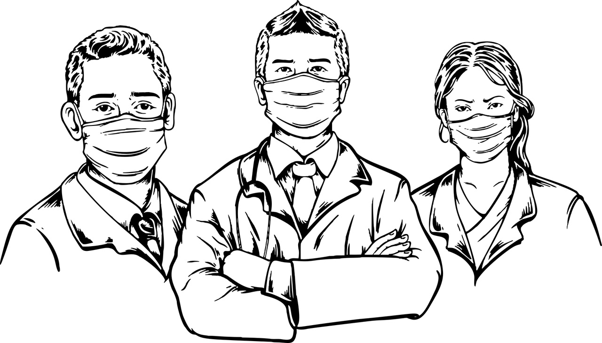

# Chest-X Ray with Radiologist AI
<a href="https://pytorch.org/get-started/locally/"></a>
[](https://pypi.org/project/kedro/)
[](https://github.com/TezRomacH/python-package-template/blob/master/LICENSE)
[](https://pypi.com/project/pip)
[](https://github.com/)
[](https://share.streamlit.io/rules99/chest-x-ray-with-radiologist-ai/main/app.py)


A deep learning system put into web production in order to supply radiological X-ray imaging assistance to physicians.

WARNING:The application web supplied is intended to be used as reference webpage. It is currently at research stage and not yet intended as production-ready webpage. We are currently trying to improve the results of the SOTA in order to have a useful and reliable application for the chest x ray imaging diagnostic.

-----------------

# How to use it?

## Project description
The web application is based on four main menus with the objective of providing medical assistance regarding to chest-X-Ray image pathology detection. 
The application have four different menus, each one with its corresponding functionality. 
1. Detection of pneumonia : from a chest X-ray image it is possible to detect if the X-ray contains pneumonia or is a normal control. 
2. Detection of multi-class pathologies: based on a radiographic image, possible pathologies are alerted. 
3. Automatic medical report generation: a diagnostic report is generated in relation to possible pathologies found in the image.
4. Radiology assistant: from an X-ray image it generates the three diagnoses mentioned above.

## Code execution

```sh
streamlit run app.py
```
--------
# Installation

## Instructions

Run the silent installation of Miniconda/Anaconda in case you don't have this software in your environment.

```sh
wget https://repo.anaconda.com/miniconda/Miniconda3-latest-Linux-x86_64.sh
bash Miniconda3-latest-Linux-x86_64.sh -b -p $HOME/miniconda3
```

Once you have installed Miniconda/Anaconda, create a Python 3.7 environment.

```sh
conda create --name cxr-rai python=3.8.13
conda activate cxr-rai
```

Clone this repository and install it inside your recently created Conda environment.

```sh
git clone https://github.com/Rules99/Chest-X-Ray-with-Radiologist-AI
cd Chest-X-Ray-with-Radiologist-AI
pip install -r requirements.txt
```

## Dependencies 
- python 3.8.13
- efficientnet 1.1.1
- gensim 3.8.3
- googletrans 4.0.0-rc1
- grad-cam 1.3.7
- h5py 3.1.0
- imgaug 0.4.0
- matplotlib 3.5.1
- nltk 3.4.5
- numpy 1.19.5
- opencv-python-headless 
- pandas   1.4.2
- plotly   5.8.0
- requests   2.27.1
- scikit_image   0.19.2
- scikit_learn   1.0.2
- seaborn   0.11.2
- streamlit   1.8.1
- streamlit-option-menu   0.3.2
- tensorflow 2.5.3
- termcolor   1.1.0
- torch   1.11.0
- torchsummary   1.5.1
- torchvision   0.12.0
- torchxrayvision   0.0.32
- transformers   2.5.1
- tqdm 4.64.0
- Pillow   9.1.0
- protobuf   3.19.0

--------
# Authors & Contributors

The application was developed by:
- [Pablo Reyes](https://github.com/Rules99)
- [Fernando Pozo](https://github.com/fpozoc)

--------
# Acknowledgements
We would like to thank the creators of the [Torchxrayvision](https://github.com/mlmed/torchxrayvision) platform for sharing their pre-trained X-ray image models.
Also thanks to [Omar-Mohamed](https://github.com/omar-mohamed) for reproducing  automatic report generation model. 

--------
# Repositories
- Torchxrayvision repo: [torchxrayvision](https://github.com/mlmed/torchxrayvision)
- Automatic Generation repo : [GPT2-Chest-X-Ray-Report-Generation](https://github.com/omar-mohamed/GPT2-Chest-X-Ray-Report-Generation)

--------
# Citation

```text
@misc{10.1093/nargab/lqab044,
    author = {Reyes, Pablo and Pozo, Fernando},
    title = "{Sistema de identificación e interpretación de patologías pulmonares a partir de imágenes rayos X mediante Aprendizaje Profundo}",
    year = {2022},
    month = {06},
    abstract = "{}",
    url = {}
}
```
--------
# References

### Databases

- Chexpert : https://stanfordmlgroup.github.io/competitions/chexpert/
- NIH      : https://www.nih.gov/
- MIMIC-CXR-JPG : https://physionet.org/content/mimic-cxr-jpg/2.0.0/
- China National Center for Bioinformation: https://ngdc.cncb.ac.cn/news/85

### Papers
https://link.springer.com/article/10.1007/s12559-020-09787-5

https://www.researchgate.net/publication/355841287_TorchXRayVision_A_library_of_chest_X-ray_datasets_and_models


https://pubmed.ncbi.nlm.nih.gov/32864270/

https://www.sciencedirect.com/science/article/pii/S2352914821000472
